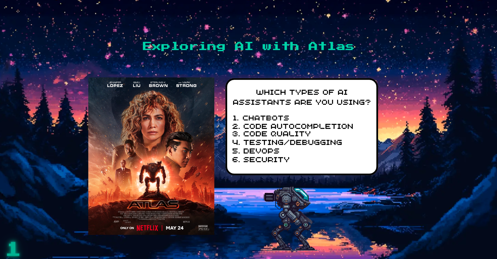

# AI-Enhanced Coding Presentation




## Overview

Welcome to the presentation on AI-assisted coding tools! This project explores the usage of tools like GitHub Copilot, Codium AI, CodeRabbit, and more, as we dive into how these tools can streamline development, testing, and code review processes.

Throughout the presentation, you’ll see demos of various AI tools in action, exploring their strengths and limitations. The presentation is interactive, so feel free to follow along!

## Resources

Here are some of the key resources mentioned in the presentation:

- [Can AI Code? Results](https://huggingface.co/spaces/mike-ravkine/can-ai-code-results) – A Hugging Face space that provides insights into AI's ability to generate code.
- [Continue.dev](https://www.continue.dev/) – A promising AI tool for assisted code writing and debugging.
- [PR-Agent Documentation](https://pr-agent-docs.codium.ai/usage-guide/changing_a_model/#azure) – Learn more about Codium AI’s PR-Agent and how to change the AI model it uses.
- [Pull Request Example](https://github.com/Baldrani/pres-lm-ia/pull/5) – A detailed pull request walkthrough used during the demo.
- [AI Tools in Action - YouTube Video](https://www.youtube.com/watch?v=6xlPJiNpCVw) – A YouTube video showcasing AI tools applied to real-world coding tasks.
- [Learning to Reason with LLMs](https://openai.com/index/learning-to-reason-with-llms/) – OpenAI’s latest research on using language models to solve complex problems.
- [Enhancing Ontology with ChatGPT for Improved Search and User Satisfaction](https://www.notion.so/Enhancing-Ontology-with-ChatGPT-for-Improved-Search-and-User-Satisfaction-302643c2cdc44e05aebd0faa0a38bea9?pvs=21) – A project exploring how ChatGPT can improve search functionality and user experience.

- [Super Mario PoC](https://codepen.io/Alexandros-Tzotzolas/pen/QWXRBrB)

## How to Use the Presentation

Once the page has loaded, you can start interacting with the presentation:

- Press `P` to load the mech.
- Press `s` to get a background.
- Control the mech with the arrow keys (left/right) and hold `Shift` for 5x speed.
- On each slide, press the `space bar` to reveal the next section of text.

## How to Run the Presentation

To run the presentation locally, follow these steps:

1. Install the necessary dependencies:
   \`\`\`bash
   npm install
   \`\`\`

2. Build the project:
   \`\`\`bash
   npm run build
   \`\`\`

3. Start the presentation:
   \`\`\`bash
   npm run start
   \`\`\`

## How to Develop

For development purposes, you can use the following commands:

- Automatically rebuild on changes:
  \`\`\`bash
  npm run build:watch
  \`\`\`

## Other Useful Links

### GitHub Copilot

- [GitHub Copilot Documentation](https://docs.github.com/en/copilot/using-github-copilot/asking-github-copilot-questions-in-your-ide) – Learn how to make the most of GitHub Copilot.
- [Community Discussions on Copilot](https://github.com/orgs/community/discussions/categories/copilot) – A place to discuss Copilot with the community and share tips.


## Poll questions

```
"Have you watched Atlas the movie?" "Yes, and I loved it" "Yes, and it sucks" "No, please no spoilers" "No, I don't care about spoilers"

"Which types of AI assistants are you using?" "Chatbots" "Code Autocompletion" "Code Quality" "Testing/Debugging" "DevOps" "Security"

"How often do you use AI tools?" "Every minute of my life" "Multiple times a day" "Multiple times a month" "I despise this :hankey:"

"Have you noticed any improvements using AI tools?" "Yes, I don’t want to know how bad I would be without it" "I grew up with them and so I have no clue" "It made me a worse developer" "I can’t code anymore without it" "I still cannot center a div"

"Has this presentation changed your mind about AI tools?" "Yes" "No" "I'm a sucker for them" "Let's go for lunch already"
```
